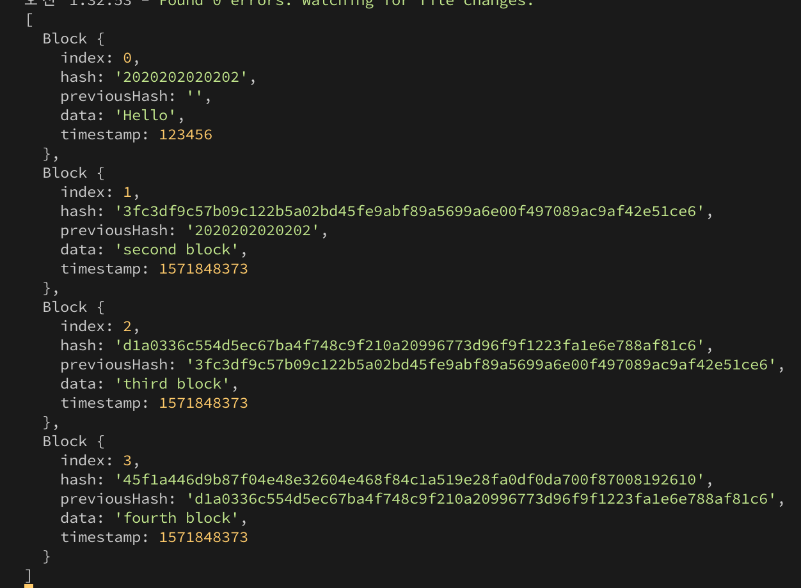

# Typechain

blockchain with Typescript. this is for practicing typescript

## Contents

- [Typechain](#typechain)
  _ [Contents](#contents)
  _ [Output](#output)
  _ [pakage.json](#pakagejson)
  _ [tsconfig.json](#tsconfigjson)
  _ [tsc-watch](#tsc-watch)
  _ [Typescript](#typescript)
  _ [Interface](#interface)
  _ [class](#class)
  _ [static](#static)
  _ [crypto-js](#crypto-js)

## Output

```js
const genesisBlock: Block = new Block(0, "2020202020202", "", "Hello", 123456);
createNewBlock("second block");
createNewBlock("third block");
createNewBlock("fourth block");
console.log(blockchain);
```



## pakage.json

1. yarn start
   tsc를 하고 index.js를 실행하는 두가지 작업을 한다.

```json
"scripts": {
"start": "node index.js",
"prestart" : "tsc"
}
```

## tsconfig.json

Typescript에게 어떻게 javascript로 변환하는 지 알려주면서 몇몇 옵션을 준다.

1. module : commonjs
   node.js를 평범하게 사용하고 다양한 걸 import 하거나 export할 수 있게 만들어 준다.

2. target : ES2015
   어떤 버전의 javascript로 컴파일 되고 싶은지 적는 거다.

3. include
   컴파일 과정에서 포함될 파일의 배열을 적으면 된다.

4. outDir: dist
   compile output durectory

## tsc-watch

> \$yarn add tsc-watch --dev

typescript 파일이 저장될 때마다 success 되면 tsc를 실행시켜 compile하는 package

## Typescript

> \$yarn add typescript

1. \$tsc
   node.js는 typescript를 이해하지 못하기 때문에 일반적인 javascript 코드로 컴파일 하는 작업이 필요하다.
   tsc는 index.ts 파일에 있는 코드를 컴파일 해서 index.js랑 index.js.map을 만들어 준다.

2. typed language
   어떤 종류의 변수와 데이터인지 설정을 해줘야 한다.

## Interface

1. Object의 type을 명시하여 준다.
2. 어떤 Object에 type을 할당 해준다. 이를 통해 코딩을 할 때 에러를 발생시킬 확률이 현저히 낮아진다.
   > person이라는 object에 Human이라는 type을 할당해줬다.

```js
interface Human {
  name: string;
  age: number;
  gender: string;
}

const sayHi = (person: Human): string => {
  return `hi, im ${person.name}. i am ${person.age} years old. i am ${person.gender}`;
};
```

## class

인터페이스는 js로 컴파일 되지 않는다. 하지만 인터페이스를 js로 넣고 싶을 때가 있을 거다. 그 때는 interface대신 class를 사용한다. class는 코드를 컨트롤 할 수 있게 해준다.

js에서는 클래스의 속성(property)들을 묘사할 필요가 없다. 그냥 클래스를 만들면 되고 어떤 속성들을 가지고 있는지 신경쓰지 않는다.
ts에서는 클래스가 어떤 속성들을 가져야 하는지 선언해야 한다. 그리고 그런 속성들이 가지고 있는 권한(permission)들도!

> public
> private

즉 interface를 사용하면 ts측면에서 좀 더 안전하다. 그런데 만약 react, expres, node등을 사용하게 된다면 코드에서 class를 사용해야 할 것이다.

```js
class Block {
  public index: number;
  public hash: string;
  public previousHash: string;
  public data: string;
  public timestamp: number;

  constructor(
    index: number,
    hash: string,
    previousHash: string,
    data: string,
    timestamp: number
  ) {
    this.index = index;
    this.hash = hash;
    this.previousHash = previousHash;
    this.data = data;
    this.timestamp = timestamp;
  }
}
```

## static

> class 안에서 method 앞에 static을 써주면 외부에서도 해당 method를 사용할 수 있다.

```js
class Block {
  static calculateBolckHash = (
    index: number,
    previousHash: string,
    timestamp: number,
    data: string
  ): string =>
    CryptoJS.SHA256(index + previousHash + timestamp + data).toString();
}

const nextHash: string = Block.calculateBolckHash(
  newIndex,
  previousHash,
  newTimestamp,
  data
);
```

## crypto-js

> yarn add crypto-js
> it allow you to get SHA256 hash result easily

```js
import * as CryptoJS from "crypto-js";

CryptoJS.SHA256(index + previousHash + timestamp + data).toStrin();
```
